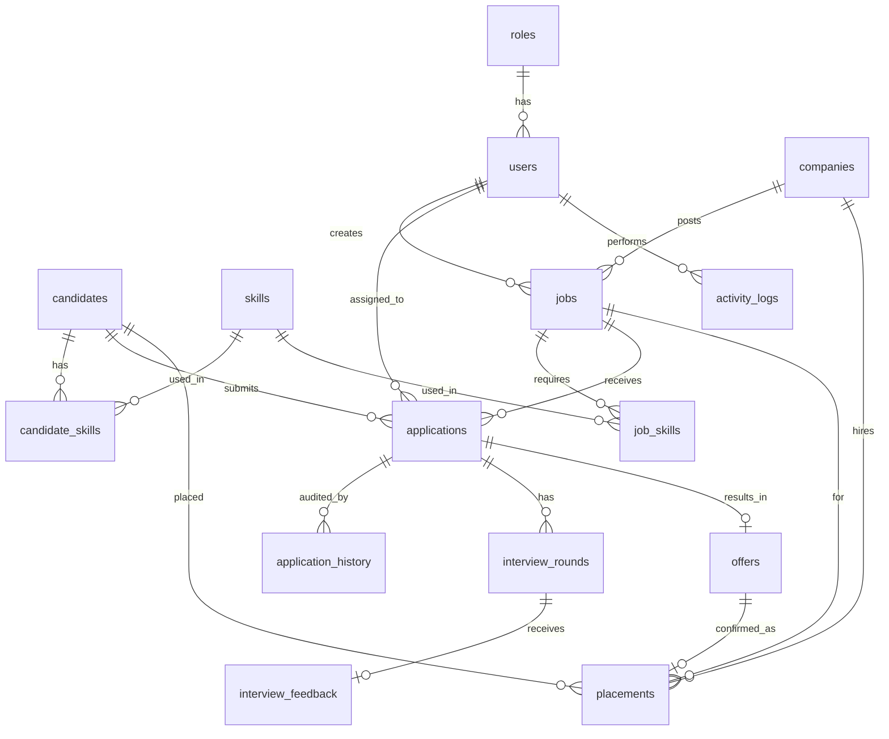

# ER Diagram (Mermaid)

Render in GitHub, VS Code (Markdown Preview Mermaid) or https://mermaid.live

```mermaid
erDiagram
  roles ||--o{ users : has
  candidates ||--o{ candidate_skills : has
  skills ||--o{ candidate_skills : used_in
  companies ||--o{ jobs : posts
  users ||--o{ jobs : creates
  jobs ||--o{ job_skills : requires
  skills ||--o{ job_skills : used_in
  candidates ||--o{ applications : submits
  jobs ||--o{ applications : receives
  users ||--o{ applications : assigned_to
  applications ||--o{ application_history : audited_by
  applications ||--o{ interview_rounds : has
  interview_rounds ||--o| interview_feedback : receives
  applications ||--o| offers : results_in
  offers ||--o| placements : confirmed_as
  candidates ||--o{ placements : placed
  companies ||--o{ placements : hires
  jobs ||--o{ placements : for
  users ||--o{ activity_logs : performs
```
